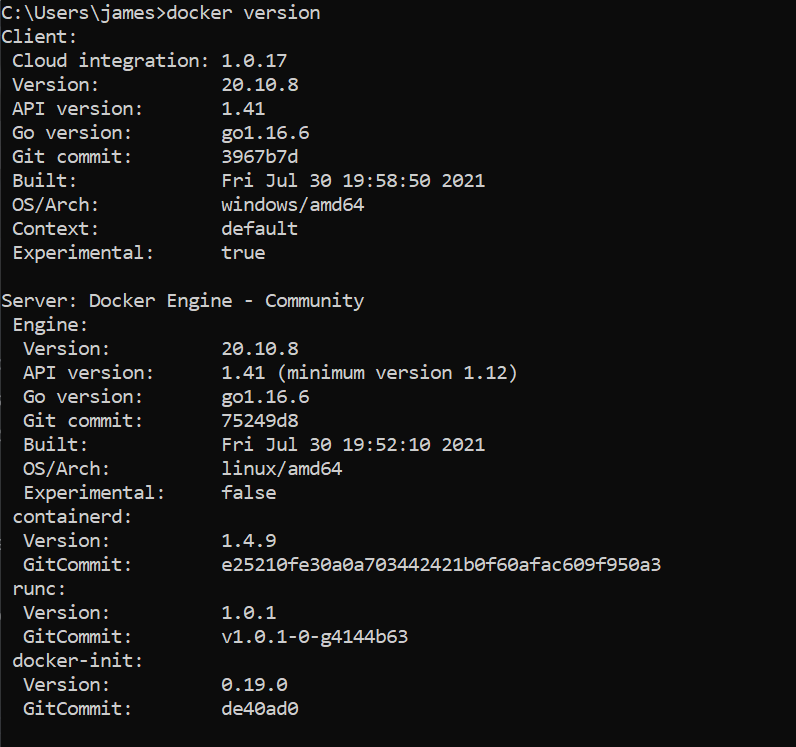
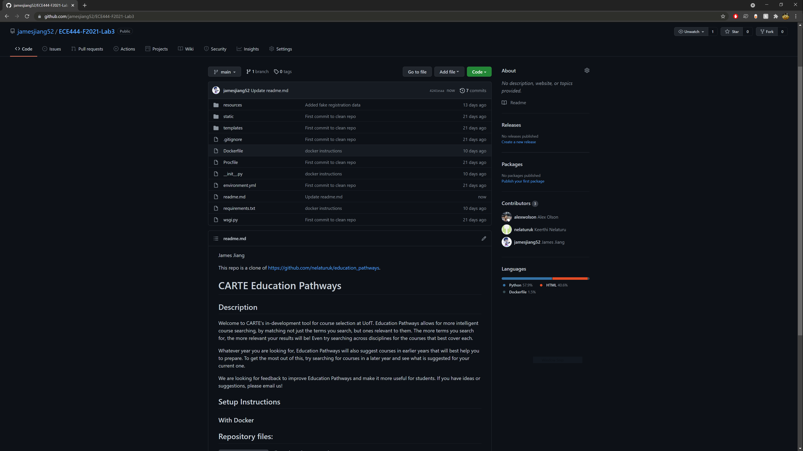
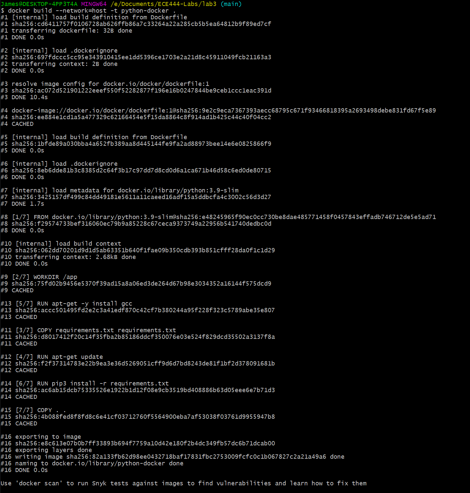
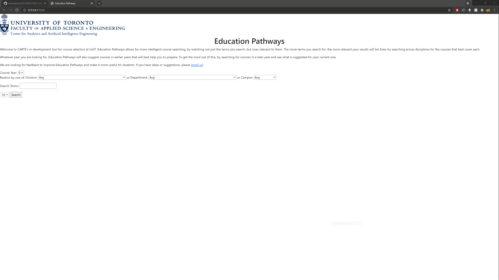
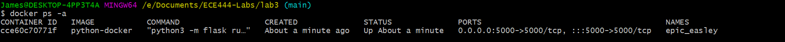

# ECE444-F2021-Lab3

Author: James Jiang

This repo is a clone of https://github.com/nelaturuk/education_pathways.

## Activity 1
Docker version:

## Activity 2
Clone Education Pathways repo:

## Activity 3
Build Docker image:

## Activity 4
Education Pathways Flask app:

Docker image:

## Activity 5

### Functional Requirement
#### Improvement
The website shall list all courses that match the filters if no keywords are specified.

#### Explanation
Currently, the search does not work if no keywords are specified. Instead, if no keywords are specified, the website should list **all** courses that match the dropdown filters.

### Non-Functional Requirement
#### Improvement
The course information page shall open in a new tab when the user clicks on a course.

#### Explanation
This pertains to the usability and convenience quality requirements. Currently, when the user clicks on a course, the course information page opens in the same tab. It would be more convenient to open it in a new tab instead, if (for example) the user wishes to browse multiple courses quickly on the same search page.
